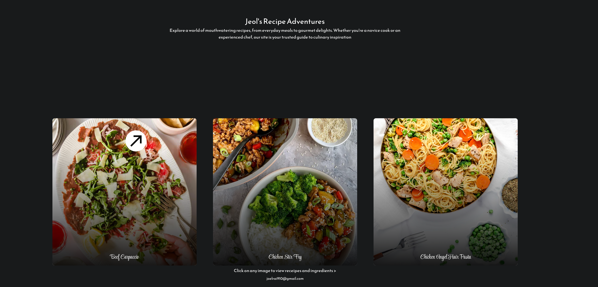

  <h1>Recipe Showcase</h1>
  
A lightweight recipe gallery built with HTML, CSS, and JavaScript.

  
  
  

 A simple interactive recipe landing page that highlights three dishes with animated cards and clickable recipe details. This project is designed to show a polished frontend experience using only static assets and vanilla JavaScript.

  

## ✨Features

- Interactive recipe gallery with three unique dishes
- Clickable image cards that reveal ingredients and recipes
- Smooth entrance animations and hover feedback
- Custom cursor trailer effect for better UI interaction
- Static frontend project with zero build steps needed

## 🚀Getting Started

### ⚙️Prerequisites

No prerequisites are required. The project runs in any modern browser.

### ⚡️Open locally

1. Open `index.html` in your browser.
2. Hover over the recipe cards to see the animation.
3. Click a dish card to load its ingredients and cooking instructions.

## 🗒️Notes

- The project is fully static and does not require a web server.
- Images are included locally in the `images/` folder for easy viewing.
- This is a first college archive project suitable for a portfolio showcase.
